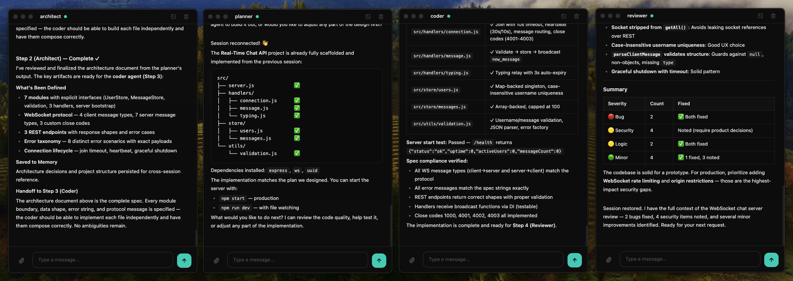

<p align="center">
  
</p>

<h1 align="center">Rune</h1>

<p align="center">
  <a href="README.md">English</a> | <a href="README.ko.md">한국어</a>
</p>

<p align="center">
  <strong>Claude Code를 위한 가장 간단한 에이전트 툴킷</strong><br/>
  SDK 없이. 보일러플레이트 없이. 파일 하나가 에이전트 하나.
</p>

<p align="center">
  
  
  
</p>

<p align="center">
  
</p>

---

## 사전 준비

- **Node.js** 18+
- **Claude Code CLI** 설치 및 로그인 — Rune은 모든 에이전트 실행에 Claude Code를 사용합니다

```bash
npm install -g @anthropic-ai/claude-code
claude                                       # 로그인이 안 되어 있다면 실행
```

> **Rune의 작동 방식:** Rune은 Claude Code의 커스텀 채널(현재 베타)을 사용하여 에이전트 기능을 확장합니다. Claude API에 직접 접근하거나 인증을 처리하지 않으며, 모든 실행은 공식 Claude Code CLI를 통해 이루어집니다.

> **사용량:** Rune은 사용자의 Claude Code CLI 세션을 통해 실행됩니다. 사용량이 구독 또는 추가 사용량에서 차감되는지 현재 확인 중이며, 확인되는 대로 업데이트하겠습니다.

## 설치

```bash
npm install -g openrune
```

---

## 30초 빠른 시작

```bash
rune new reviewer --role "Code reviewer, security focused"
rune run reviewer.rune "Review the latest commit"
```

이게 끝입니다. 에이전트를 만들었습니다.

---

## Agent Teams와 뭐가 다른가요?

Claude Code의 Agent Teams는 런타임에 팀원을 생성합니다 — 강력하지만, 세션이 끝나면 사라집니다.

Rune은 다른 접근을 합니다: **에이전트가 파일입니다.**

| | Agent Teams | Rune |
|---|---|---|
| **영구 저장** | 세션 한정 — 완료되면 에이전트 소멸 | `.rune` 파일로 히스토리와 메모리가 영구 보존 |
| **이동성** | 하나의 Claude Code 세션에 종속 | `.rune` 파일을 어디서든 공유, 버전 관리, 재사용 |
| **스케줄링** | 수동 실행만 가능 | Cron, 파일 변경, git-commit 트리거 |
| **권한** | 세션에서 상속 | 에이전트별 제어 (`fileWrite`, `bash`, `allowPaths`) |
| **실행** | 대화형 | 헤드리스, 파이프라인, CI/CD 지원 |

Rune 에이전트는 세션, 머신, 팀을 넘어 살아남습니다. 한 번 만들면 영원히 실행.

---

## 핵심 개념

### 파일 하나 = 에이전트 하나

```bash
rune new architect --role "Software architect"
rune new coder --role "Backend developer"
rune new reviewer --role "Code reviewer"
```

각 `.rune` 파일은 JSON입니다 — 이동 가능하고, 공유 가능하고, 버전 관리 가능:

```json
{
  "name": "reviewer",
  "role": "Code reviewer, security focused",
  "permissions": {
    "fileWrite": false,
    "bash": false,
    "allowPaths": ["src/**"],
    "denyPaths": [".env", "secrets/**"]
  },
  "history": [],
  "memory": []
}
```

### 권한

각 에이전트가 할 수 있는 것을 제어합니다. 권한 미설정 = 전체 접근 (하위 호환):

```json
{
  "permissions": {
    "fileWrite": false,
    "bash": false,
    "network": false,
    "allowPaths": ["src/**", "tests/**"],
    "denyPaths": [".env", "secrets/**", "node_modules/**"]
  }
}
```

- `fileWrite: false` — 에이전트가 파일을 읽을 수만 있고 쓰기/편집 불가
- `bash: false` — 에이전트가 셸 명령어 실행 불가
- `network: false` — 에이전트가 웹 요청 불가
- `allowPaths` / `denyPaths` — 특정 패턴으로 파일 접근 제한

`src/`만 읽을 수 있는 리뷰어: 안전. 어디든 쓸 수 있는 코더: 강력. 에이전트별로 결정하세요.

### 구조화된 로깅

에이전트가 무엇을 했는지, 얼마나 걸렸는지, 비용은 얼마인지 추적:

```bash
rune run reviewer.rune "Review this project" --auto --log review.json
```

```json
{
  "agent": "reviewer",
  "prompt": "Review this project",
  "duration_ms": 12340,
  "cost_usd": 0.045,
  "tool_calls": [
    { "tool": "Read", "input": { "file_path": "src/index.ts" } },
    { "tool": "Grep", "input": { "pattern": "TODO" } }
  ],
  "result": "Found 3 issues..."
}
```

### 자기 복제 에이전트

에이전트가 스스로 다른 에이전트를 만들고 조율할 수 있습니다:

```bash
rune new manager --role "Project manager. Create agents with rune new and coordinate them with rune pipe."
rune run manager.rune "Create a summarizer and a translator agent, then pipe them to summarize and translate this news article into Korean." --auto
```

매니저가 하는 일:
1. `rune new summarizer --role "..."` 실행
2. `rune new translator --role "..."` 실행
3. `rune pipe summarizer.rune translator.rune "..."` 실행
4. 실패하면 스스로 디버깅하고 수정

에이전트가 에이전트를 만듭니다. 사람 개입 없이.

### 헤드리스 실행

터미널에서 에이전트를 실행합니다. GUI 필요 없음:

```bash
rune run reviewer.rune "Review the latest commit"

# 다른 명령어에서 입력을 파이프
git diff | rune run reviewer.rune "Review this diff"

# 스크립팅을 위한 JSON 출력
rune run reviewer.rune "Check for security issues" --output json
```

### 자율 모드

`--auto`를 사용하면 에이전트가 파일을 쓰고, 명령어를 실행하고, 오류를 스스로 수정합니다:

```bash
rune run coder.rune "Create an Express server with a /health endpoint. Run npm init and npm install." --auto
```

```
🔮 [auto] coder is working on: Create an Express server...

  ▶ Write: /path/to/server.js
  ▶ Bash: npm init -y
  ▶ Bash: npm install express
  💬 Server created and dependencies installed.

✓ coder finished
```

### 에이전트 파이프라인

에이전트를 체이닝합니다. 각 에이전트의 출력이 다음 에이전트의 입력이 됩니다:

```bash
rune pipe architect.rune coder.rune "Build a REST API with Express"
```

`--auto`를 사용하면 마지막 에이전트가 계획을 실행합니다:

```bash
rune pipe architect.rune coder.rune "Build a REST API with Express" --auto
```

architect가 설계 → coder가 구현 (파일 작성, 의존성 설치).

### 자동화 트리거

```bash
# 매 git commit마다
rune watch reviewer.rune --on git-commit --prompt "Review this commit"

# 파일 변경 시
rune watch linter.rune --on file-change --glob "src/**/*.ts" --prompt "Check for issues"

# 스케줄에 따라
rune watch monitor.rune --on cron --interval 5m --prompt "Check server health"
```

### Node.js API

자신의 코드에서 에이전트를 사용하세요. 각 `.send()` 호출은 Claude Code 프로세스를 생성하므로, 머신에 Claude Code CLI가 설치되고 로그인되어 있어야 합니다.

```js
const rune = require('openrune')

const reviewer = rune.load('reviewer.rune')
const result = await reviewer.send('Review the latest commit')

// 파이프라인
const { finalOutput } = await rune.pipe(
  ['architect.rune', 'coder.rune'],
  'Build a REST API'
)
```

---

## 예제: 에이전트 기반 API 서버

처음부터 에이전트가 구축한 서버까지의 전체 과정.

### 1. 설치 및 에이전트 생성

```bash
npm install -g openrune
mkdir my-project && cd my-project

rune new architect --role "Software architect. Design system architecture concisely."
rune new coder --role "Backend developer. Implement code based on the given plan."
rune new reviewer --role "Code reviewer. Review for bugs and security issues."
```

### 2. 에이전트가 협업하여 서버 구축

```bash
rune pipe architect.rune coder.rune "Design and build an Express server with POST /review endpoint that uses require('openrune') to load reviewer.rune and send the prompt. Run npm init -y and npm install express openrune." --auto
```

architect가 아키텍처 설계 → coder가 `server.js` 작성, `npm init` 실행, 의존성 설치.

### 3. 서버 시작

```bash
node server.js
```

### 4. API로 에이전트 호출

```bash
curl -X POST http://localhost:3000/review \
  -H "Content-Type: application/json" \
  -d '{"prompt": "Review this project"}'
```

reviewer 에이전트가 프로젝트를 분석하고 전체 코드 리뷰를 반환합니다.

### 5. 데스크톱 UI 열기

```bash
rune open reviewer.rune
```

API 호출의 대화 히스토리가 이미 있습니다 — CLI, API, GUI 간에 컨텍스트가 유지됩니다.

---

## 데스크톱 UI

Rune은 대화형 채팅을 위한 선택적 데스크톱 앱을 포함합니다.

```bash
rune open reviewer.rune
```

또는 Finder에서 `.rune` 파일을 더블 클릭하세요.

<p align="center">
  
</p>

- **실시간 활동** — 도구 호출, 결과, 권한 요청을 실시간으로 확인.
- **내장 터미널** — Claude Code 출력과 사용자 명령어를 나란히.
- **우클릭으로 생성** — macOS Quick Action으로 Finder에서 에이전트 생성.

> 더블 클릭이 작동하지 않으면 `rune install`을 한 번 실행하여 파일 연결을 등록하세요.

---

## CLI 레퍼런스

| 명령어 | 설명 |
|---------|------|
| `rune new <name> [--role "..."]` | 에이전트 생성 |
| `rune run <file> "prompt" [--auto] [--output json]` | 헤드리스 실행 |
| `rune pipe <a> <b> [...] "prompt" [--auto]` | 에이전트 체이닝 |
| `rune watch <file> --on <event> --prompt "..."` | 자동화 트리거 |
| `rune open <file>` | 데스크톱 UI |
| `rune list` | 현재 디렉토리의 에이전트 목록 |
| `rune install` | 파일 연결 및 Quick Action 설정 |

**Watch 이벤트:** `git-commit`, `git-push`, `file-change` (`--glob` 사용), `cron` (`--interval` 사용)

---

## 플랫폼 지원

| 플랫폼 | 상태 |
|--------|------|
| macOS | 지원 |
| Windows | 지원 |
| Linux | 지원 |

---

## 라이선스

MIT
