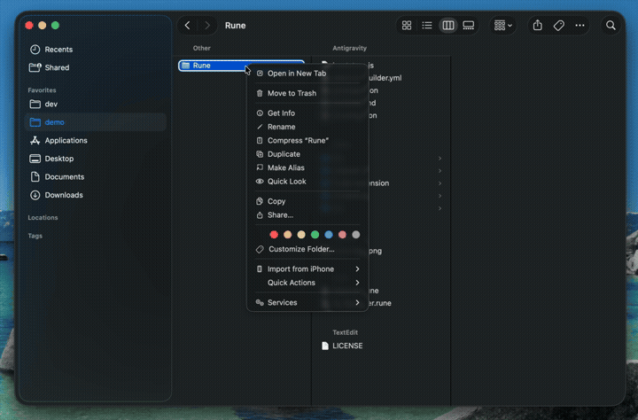
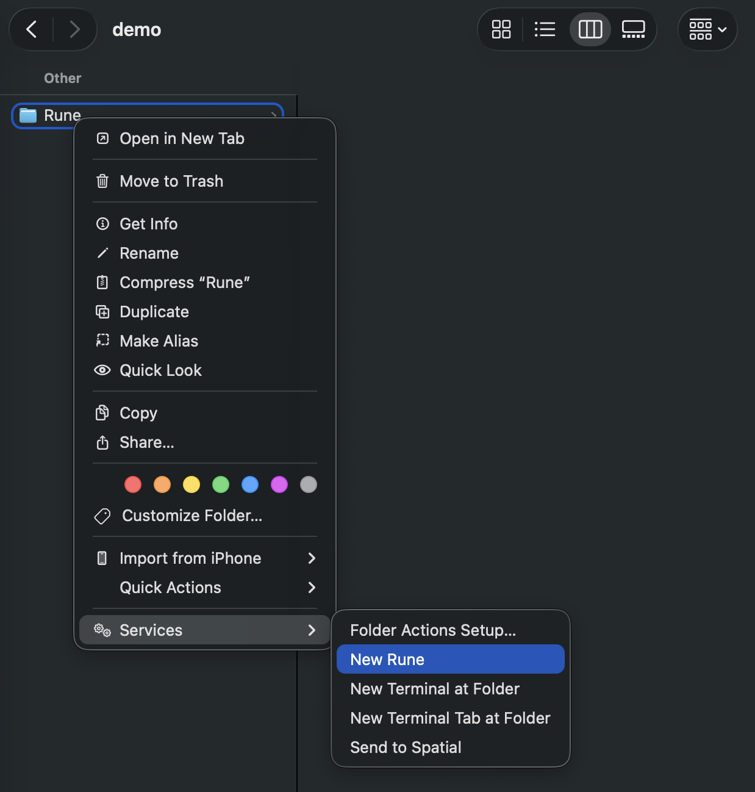

<p align="center">
  
</p>

<h1 align="center">Rune</h1>

<p align="center">
  <strong>File-based AI Agent Harness for Claude Code</strong><br/>
  Drop a <code>.rune</code> file in any folder. Run it headlessly, chain agents, or open the desktop UI.
</p>

<p align="center">
  
  
  
</p>

---

## What is Rune?

Rune turns any folder into an AI workspace. Each `.rune` file is an independent AI agent with its own chat history, role, and context — all powered by [Claude Code](https://docs.anthropic.com/en/docs/claude-code).

- **File-based** — One `.rune` file = one agent. Move it, share it, version it with git.
- **Folder-aware** — The agent knows your project. It can read files, run commands, and write code.
- **Real-time activity** — See every tool call, permission request, and agent action as it happens via Claude Code hooks.
- **Desktop-native** — Lightweight Electron app with built-in terminal. No browser needed.
- **Right-click to create** — macOS Quick Action lets you create agents from Finder.

---

## Why Rune?

Building a Claude Code harness usually means wiring up process management, I/O parsing, state handling, and a UI from scratch. Rune lets you skip all of that — just drop a file and go.

**No harness boilerplate** — No SDK wiring, no process management, no custom I/O parsing. One `.rune` file gives you a fully working Claude Code agent with a desktop UI.

**Persistent context** — Your agent remembers everything. Close the app, reopen it next week — the conversation and context are right where you left off.

**Portable** — The `.rune` file is just a JSON file. Copy it to another machine, share it with a teammate, or check it into git. Your agent goes wherever the file goes.

**Multiple agents per folder** — Need a code reviewer AND a backend developer in the same project? Create two `.rune` files. Each agent has its own role, history, and expertise — working side by side in the same folder.

**No setup per project** — No config files, no extensions, no workspace settings. Drop a `.rune` file and you're ready.

<p align="center">
  
</p>

---

## Quick Start

### Prerequisites

- **Node.js** 18+
- **Claude Code CLI** — `npm install -g @anthropic-ai/claude-code`

### 1. Install

```bash
npm install -g openrune
```

### 2. Create your first agent

```bash
cd ~/my-project
rune new myagent
```

Or right-click any folder in Finder → Quick Actions → **New Rune**

<p align="center">
  
</p>

### 3. Open and chat

**Double-click** the `.rune` file, or:

```bash
rune open myagent.rune
```

---

## Features

### Chat UI

- **Markdown rendering** — Code blocks, tables, lists with syntax highlighting.
- **File attachment** — Drag and drop files or click to attach. The agent reads them from your filesystem.
- **Stream cancellation** — Stop a response mid-stream.
- **Chat history** — Persisted in the `.rune` file. Clear anytime.

### Real-time Activity Monitoring

Rune uses [Claude Code hooks](https://docs.anthropic.com/en/docs/claude-code/hooks) to capture all agent activity in real-time:

- **Tool calls** — See when the agent reads files, edits code, runs commands.
- **Tool results** — See the output of each action.
- **Permission requests** — Get notified when the agent needs approval.
- **Session events** — Track when sessions start, stop, or encounter errors.

No more guessing what the agent is doing — everything is visible in the chat panel.

### Built-in Terminal

Toggle the terminal panel to see raw Claude Code output or run your own commands alongside the agent.

### Agent Roles

```bash
# General assistant
rune new assistant

# Specialized agents
rune new designer --role "UI/UX design expert"
rune new backend --role "Backend developer, Node.js specialist"
rune new reviewer --role "Code reviewer, focused on security and performance"
```

### The `.rune` File

A `.rune` file is just JSON:

```json
{
  "name": "myagent",
  "role": "General assistant",
  "icon": "bot",
  "createdAt": "2025-01-01T00:00:00Z",
  "history": []
}
```

Edit the `role` field anytime to change the agent's behavior.

---

## CLI Commands

| Command | Description |
|---------|-------------|
| `rune install` | Build app, register file association, install Quick Action |
| `rune new <name>` | Create a `.rune` file in the current directory |
| `rune new <name> --role "..."` | Create with a custom role |
| `rune open <file.rune>` | Open a `.rune` file (desktop GUI) |
| `rune run <file.rune> "prompt"` | Run agent headlessly (no GUI) |
| `rune pipe <a.rune> <b.rune> "prompt"` | Chain agents in a pipeline |
| `rune watch <file.rune> --on <event>` | Set up automated triggers |
| `rune list` | List `.rune` files in the current directory |
| `rune uninstall` | Remove Rune integration (keeps your `.rune` files) |

---

## Harness Mode

Rune isn't just a desktop app — it's a full agent harness. Use it from scripts, CI/CD, or your own tools.

### Headless execution

Run any `.rune` agent from the command line without opening the GUI:

```bash
rune run reviewer.rune "Review the latest commit"

# Pipe input from other commands
git diff | rune run reviewer.rune "Review this diff"

# JSON output for scripting
rune run reviewer.rune "Review src/auth.ts" --output json
```

### Agent chaining

Chain multiple agents into a pipeline. The output of each agent becomes the input for the next:

```bash
rune pipe coder.rune reviewer.rune tester.rune "Implement a login page"
```

This runs: coder writes the code → reviewer reviews it → tester writes tests.

### Automated triggers

Set agents to run automatically on events:

```bash
# Run on every git commit
rune watch reviewer.rune --on git-commit --prompt "Review this commit"

# Watch for file changes
rune watch linter.rune --on file-change --glob "src/**/*.ts" --prompt "Check for issues"

# Run on a schedule
rune watch monitor.rune --on cron --interval 5m --prompt "Check server health"
```

### Node.js API

Use Rune agents programmatically in your own code:

```js
const rune = require('openrune')

const reviewer = rune.load('reviewer.rune')
const result = await reviewer.send('Review the latest commit')
console.log(result)

// Agent chaining via API
const { finalOutput } = await rune.pipe(
  ['coder.rune', 'reviewer.rune'],
  'Implement a login page'
)
```

---

## Architecture

```
User ↔ Chat UI (React)
         ↕ IPC
       Electron Main Process
         ↕ HTTP + SSE
       MCP Channel (rune-channel)         Claude Code Hooks
         ↕ MCP                              ↕ HTTP POST
       Claude Code CLI  ──────────────→  rune-channel /hook
```

**Two paths for data:**

1. **Chat input** → MCP channel → Claude Code (user messages)
2. **Claude Code hooks** → rune-channel → SSE → Chat UI (activity monitoring)

The hooks approach ensures Rune sees everything Claude does, without relying on the agent to self-report.

---

## Development

### Setup

```bash
git clone https://github.com/gilhyun/Rune.git
cd Rune
npm install
```

### Build & Run

```bash
# Build and launch
npm start

# Build only
npm run build
```

### Project Structure

```
Rune/
  bin/rune.js              # CLI tool (install, new, open, list)
  src/
    main.ts                # Electron main process
    preload.ts             # Preload bridge (IPC security)
  channel/
    rune-channel.ts        # MCP channel + hooks HTTP endpoint
  renderer/
    src/
      App.tsx              # Root React component
      features/
        chat/              # Chat UI (input, messages, activity blocks)
        terminal/          # Built-in terminal (xterm.js + node-pty)
      hooks/               # IPC hooks
      lib/                 # Utilities
```

### Hooks Configuration

Rune automatically sets up Claude Code hooks in `~/.claude/settings.json`. The hooks only fire when `RUNE_CHANNEL_PORT` is set, so they don't affect standalone Claude Code usage.

Captured events: `PreToolUse`, `PostToolUse`, `PermissionRequest`, `UserPromptSubmit`, `Stop`, `Notification`, `SessionStart`, `SessionEnd`.

---

## Important Notice

> **Rune is currently in early development.** The MCP channel (`rune-channel`) loads via Claude Code's `--dangerously-load-development-channels` flag. This is a development-only feature and may change in future Claude Code releases. Use at your own discretion.

---

## Troubleshooting

### "Channel disconnected"

The Claude Code CLI isn't running. It should start automatically via the terminal. If not:

```bash
cd /your/project/folder
RUNE_CHANNEL_PORT=<port> claude --permission-mode auto --enable-auto-mode
```

### Quick Action doesn't appear

Open **System Settings** → **Privacy & Security** → **Extensions** → **Finder** and enable **New Rune**.

---

## Platform Support

| Platform | Status |
|----------|--------|
| macOS | Supported |
| Windows | Coming soon |
| Linux | Coming soon |

---

## License

MIT
